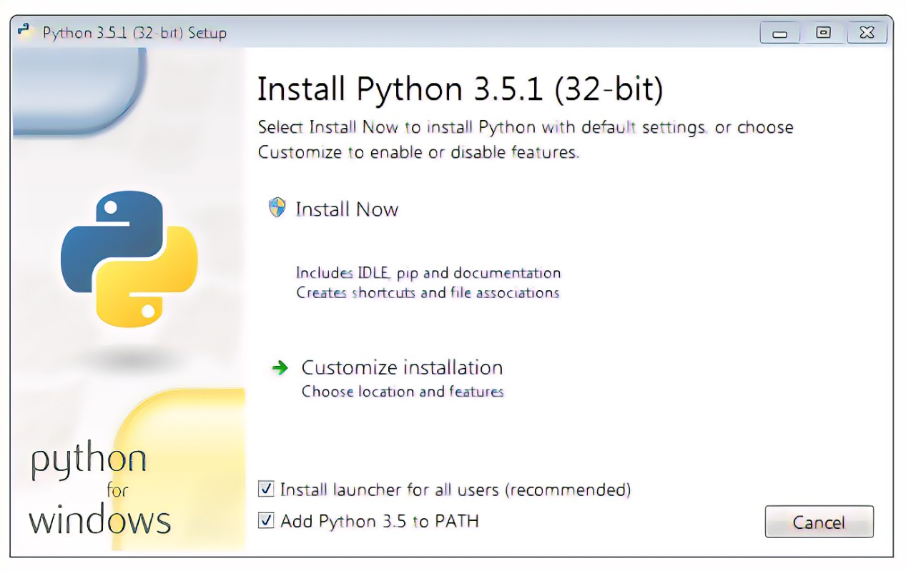
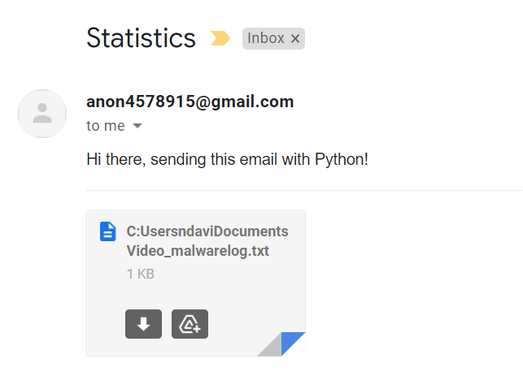
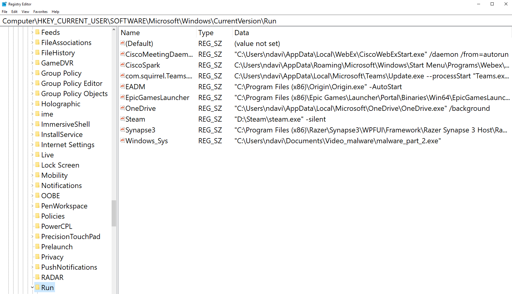
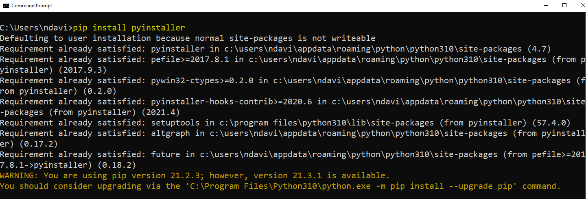
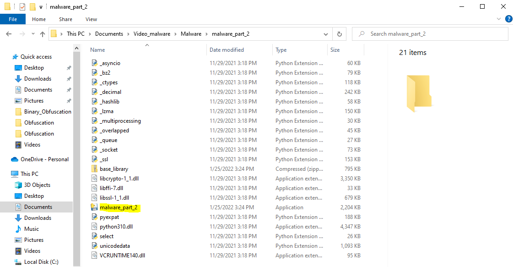
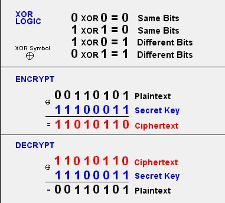
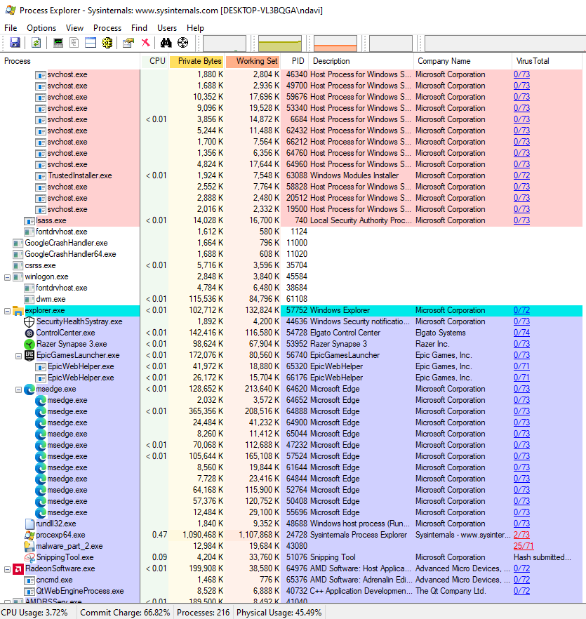

# Keylogger-Malware-Project
A guide to building basic malware in Python by implementing a keylogger application.
If you want even more detail on the Project view my Youtube Series linked **[here](https://www.youtube.com/playlist?list=PLMny8m8fg2WDKz5zEBGtJ2XDN7fR01QPk)**.

### Purpose of the Project
This repository is made for the purpose of learning how basic malware can be created, obfuscated, and then deobfuscated for malware analysis. Through this repository, a fully working keylogger with the ability to exfiltrate data as well as persist on host machines will be presented.  In addition to this, it will be shown how to bypass Windows Defender, a native Windows anti-virus software.

### Disclaimer
This repository is soley presented for the sake of learning.  Do not use anything from this repository for malicous purposes. Replication of this repository for malicous use on a computer or system that you do not own is **strictly prohibited!**

## Building a Working Version of the Keylogger

### Installing Python
The first step is to download the Python programming language on to your computer. The link to the python download page is **[here](https://www.python.org/downloads/)**. Select Windows, Linux/UNIX or macOS and download the latest version of Python. Note: When installing Python make sure to add to PATH.

### Installing the Pynput Module
Pynput is an external module not included in the default installation of Python.  Pynput allows a program to take in a user's key presses.  To install Pynput, go to the command prompt in Windows or the terminal in Linux or macOS.  Once in the command prompt/terminal, run: 
> pip install pynput

### Programming the Keylogger: Part 1
After implementing this part of the keylogger, the program will take in key presses from the user and log them to a text file where the key presses can be later retreived. If you are wanting further explanation of how the code itself works, visit my youtube video linked **[here](https://youtu.be/SGLMPFmqsNE)**.  
The code can be found in the Code folder as **malware_part_1**  or in the link below:

[malware-part-1](Code/malware_part_1.py)

Searching in Google with Keylogger running:

The resulting contents of of the log.txt file:

## Adding Data Exfiltration and Persistance (Programming the Keylogger: Part 2)
This section is explained in greater detail in the corresponding Youtube linked **[here](https://youtu.be/_MD0g9OmSW0)**.

### Data Exfiltration
The current state of the keylogger saves user key presses to a log.txt file, but does not do anything with that log file.  To exfiltrate the log.txt file we are going to use email.  A fake email must be created, so the keylogger can login to this email and then send the log.txt file to an email of your choosing. The **email()** function must be added and called as it is in the code linked below:

[malware-part-2](Code/malware_part_2.py)

After downloading the code, **within the email() function; the email_user, email_password, and email_send variables must be filled in with corresponding values explained in the comments**. 

After running this updated code and typing in 50 keys or pressing the escape key, the email will be sent from the new email to the email specified. The email will look as follows:

### Persistance
Persistance is the ability to maintain access to a computer or computer system across reboots.  If the victim that has malware on their computer shuts down their machine, persistance built into the malware would allow it to survive the shut down and reboot upon the next start up.  One way to accomplish this on Windows, is by editing the registry keys.  Registry keys define a large amount of system information that Windows references.  If able to create a new registry key value, one could change the way the Windows machine behaves. Lets take a look at how registry keys are stored:

To access the Windows Registry:
>Hold the Windows button and press R

This will then open the run prompt. To access the Windows Registry type:
>regedit

Once in the Registory Editor you will see a similar screen to the image below. Registry keys are laid out in a folder-like structure, so the folders you see here are the top folders, also known as registry hives.

To get to the registry key that is used to specify applications that run on startup, go down the following file path:
>HKEY_CURRENT_USER\SOFTWARE\Microsoft\Windows\CurrentVersion\Run

This will reveal all of the programs that run on boot, and the goal of adding persistance to the keylogger is to add a new registry key value in this folder that allows our malware to relaunch on boot.

To actually get the keylogger to make a new registry key value inside that folder, implement the **Add_To_StartUp()** function as well as call it as is shown in the following code:

[malware-part-2](Code/malware_part_2.py)

After running this code, if you go back to the Registry editor under the same Run folder, you will see the new "Windows_Sys" program, which means it has been successfully added to startup.

## Obfuscation

This section will detail how to obfuscate the [malware-part-2](Code/malware_part_2.py) code using both binary obfuscation and XOR obfuscation in the attempt to bypass anti-virus software.  In addition to this, it will illustrated how to compile a python program into an executable file.

This section is explained in greater detail in my corresponding youtube video linked **[here](https://youtu.be/ul4S42u0tUQ)**.

### Installing PyInstaller

PyInstaller is a program that allows a python program to be compiled into an executable, so a victim machine is not required to have python or external modules used downloaded. To install open the command prompt/terminal and type the following command:
>pip install pyinstaller

This will download the program and allow it to be used.

To then create an executable for [malware-part-2](Code/malware_part_2.py), move into the directory in which the file sits, and run the following command:
>python -m PyInstaller --noconsole malware_part_2.py

After completing this a new folder should be created inside a "dist" folder.  Once going inside the "dist" folder you will see a malware_part_2 folder, this is the folder you need. The following is a picture of such a folder:

Click on the malware_part_2 folder and you should see the executable, highlighted, as well as all of its dependencies as below:

You can now simply double click on the highlighted executable and the program will run as it normally did before. This will work on any Windows machine regardless of if they have python installed!

### Binary Obfuscation

One possible way to try to obfuscate source code is to transform it into binary, 1's and 0's. You will need a program such as **[binary-obfuscator](Code/binary_obfuscator.py)** to create a binary string that represents your source code.

After running this code, you will be presented with a binary string that looks like the following:

This string is what you need to actually run an obfuscated version of your code. You will need to dowload the **[binary-obfuscation](Code/binary_obfuscation.py)** program and then plug in the binary string into the "binary" variable as follows:

After plugging this in, the program will run as it normally did in the [malware-part_2](Code/malware_part_2.py) program, but the source code is now hidden using basic binary obfuscation. This can be majorly improved adding more complexity on top of this, but we will stop here for the sake of the example.

### XOR Obfuscation

Another way to implement obfuscation is through encrypting your code and then decrypting it on run time.  A great, easy way to do this is by using XOR encryption. The XOR operation simply compares two different binary groupings. The operations are as follows in the table:

As seen, the same key in XOR operations can be used to encrypt and decrypt data, meaning this is a symmetric encryption method.

Similar to how the binary obfuscation was done, we will need a program that encrypts our code to give us our ciphertext and key, and then we will plug in this ciphertext and key in to another program that will actually run the obfuscated program and decrypt our code at run time.

The **[XOR-encrypter](Code/encrypter.py)** program will give the cipher text and 100 digit key that is needed. After running the encrypted code, it will appear as follows:

The 100 digit, symmetric key will appear as follows:

After retreiving the encrypted code and the key, then plug these into the **[xor-obfuscation](Code/obfuscation_xor.py)** file to be able to run the obfuscated program.
The code and key will need to be plugged in as is shown below:

Upon plugging in the encrypted code and the key, the program is ready to be ran and will decrypt the code at run time and give the same functionality as the unobfuscated program.

### Compiling binary_obfuscation.py and obfuscation_xor.py with PyInstaller
We now need to compile our **[binary_obfuscation](Code/binary_obfuscation.py)** and **[xor-obfuscation](Code/obfuscation_xor.py)** as we did with the [malware-part_2](Code/malware_part_2.py) program using PyInstaller.

Retrace the steps taken in the **Installing PyInstaller** section to form an exexutable for each program. The command should look similar as below with the correct file name inputted:

>python -m PyInstaller --noconsole [file_name]

### Virus Total Results

VirusTotal is an awesome online tool where a malicous file can be uploaded and it will run it through various anti-virus software to see if it flags as malicous. It is often used as a way to test suspicous files, but can also be utilized by malware authors.

The link to the website is **[here](https://www.virustotal.com/gui/home/upload)**.

To test the different programs, simply select the executable file from within the folder that PyInstaller created and upload!

I got the following results:

**malaware_part_2 (unobfuscated)**

**binary_obfuscation**

**obfuscation_xor**

This shows the huge impact that obfuscation can have on malware authors getting their malware past anti-virus software!

## Malware Analysis

For the most part in this project, we have discussed offensive methods of creating malware to better understand how malware is built and how it interacts with detction systems such as antivirus software. In this section, we will take a defensive stance and conduct malware analysis, both static and dynamic.

### Dynamic Analysis

Dynamic analysis gathers information about malware and its behavior through live execution of the sample. This is often done in a sandboxed environment or virtual machine to prevent infection of the host computer or propagation through the network.

Download the following Dynamic Analysis tools:
- [Autoruns](https://docs.microsoft.com/en-us/sysinternals/downloads/autoruns)
- [Process Explorer](https://docs.microsoft.com/en-us/sysinternals/downloads/process-explorer)
- [Process Monitor](https://docs.microsoft.com/en-us/sysinternals/downloads/procmon)
- [Regshot](https://sourceforge.net/projects/regshot/)

#### Autoruns
Autoruns is a software tool that allows you to clearly see registry key values and especially programs that are set to run on boot.  This tool can help find malware that is implementing persistance measures or changing other registry keys in a Windows environment.

Here is an Example of what a malicous program may look like in Autoruns:

As seen above, the key values for different registry keys are shown that correlate with programs that auto start on boot. We have many normal autoboot programs such as: CiscoSpark, EpicGamesLauncher, and Steam. One program that immediately stands out, is the Windows_Sys program.  While it may sound like a Windows underlying system process, it is actually our malicous keylogger program from earlier.  Some evidence of it being malicous is that fact that it does not have a verified publisher, and the virus total scan came back with 25 antivirus softwares that flagged it as malicous, since I scanned the unobfuscated version here. (Yes, Autoruns checks VirusTotal too!)

#### Process Explorer

Process Explorer is a software tool that allows you to monitor all programs/processes that are actiely running on your machine in Windows.  It is essentially a very much expanded task manager.  One of the really awesome features of Process Explorer is that you can check the properties of any active program on your system. Included in these properties is the performance of the program, i.e. CPU priority and read and write information; TCP/IP information such as where a program may be connecting back too; and string data that is found in the actual executable.

Here is an example of what Process Explorer's main page looks like:

