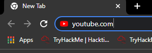
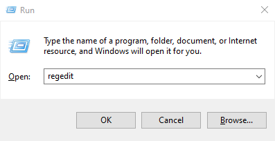
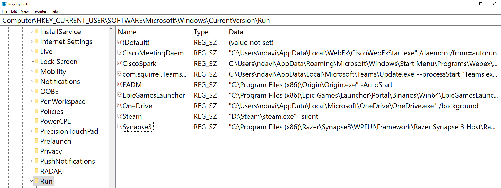

# Keylogger-Malware-Project
A guide to building basic malware in Python by implementing a keylogger application.
If you want even more detail on the Project view my Youtube Series linked **[here](https://www.youtube.com/playlist?list=PLMny8m8fg2WDKz5zEBGtJ2XDN7fR01QPk)**.

### Purpose of the Project
This repository is made for the purpose of learning how basic malware can be created, obfuscated, and then deobfuscated for malware analysis. Through this repository, a fully working keylogger with the ability to exfiltrate data as well as persist on host machines will be presented.  In addition to this, it will be shown how to bypass Windows Defender, a native Windows anti-virus software.

### Disclaimer
This repository is soley presented for the sake of learning.  Do not use anything from this repository for malicous purposes. Replication of this repository for malicous use on a computer or system that you do not own is **strictly prohibited!**

## Building a Working Version of the Keylogger

### Installing Python
The first step is to download the Python programming language on to your computer. The link to the python download page is **[here](https://www.python.org/downloads/)**. Select Windows, Linux/UNIX or macOS and download the latest version of Python. Note: When installing Python make sure to add to PATH.

### Installing the Pynput Module
Pynput is an external module not included in the default installation of Python.  Pynput allows a program to take in a user's key presses.  To install Pynput, go to the command prompt in Windows or the terminal in Linux or macOS.  Once in the command prompt/terminal, run: 
> pip install pynput

### Programming the Keylogger: Part 1
After implementing this part of the keylogger, the program will take in key presses from the user and log them to a text file where the key presses can be later retreived. If you are wanting further explanation of how the code itself works, visit my youtube video linked **[here](https://youtu.be/SGLMPFmqsNE)**.  
The code can be found in the Code folder as **malware_part_1**  or in the link below:

[malware-part-1](Code/malware_part_1.py)

Searching in Google with Keylogger running:

The resulting contents of of the log.txt file:

## Adding Data Exfiltration and Persistance to the Keylogger

### Data Exfiltration
The current state of the keylogger saves user key presses to a log.txt file, but does not do anything with that log file.  To exfiltrate the log.txt file we are going to use email.  A fake email must be created, so the keylogger can login to this email and then send the log.txt file to an email of your choosing. The email() function must be added and called as it is in the code linked below:

[malware-part-2](Code/malware_part_2.py)

### Persistance
Persistance is the ability to maintain access to a computer or computer system across reboots.  If the victim that has malware on their computer shuts down their machine, persistance built into the malware would allow it to survive the shut down and reboot upon the next start up.  One way to accomplish this on Windows is by editing the registry keys.  Registry keys define a large amount of system information that Windows references.  If able to create a new registry key value, one could change the way the Windows machine behaves. Lets take a look at how registry keys are stored:

To access the Windows Registry:
>Hold the Windows button and press R

This will then open the run prompt. To access the Windows Registry type:
>regedit

Once in the Registory Editor you will see a similar screen to the image below. Registry keys are laid out in a folder-like structure, so the folders you see here are the top folders, also known as registry hives.

To get to the registry key that is used to specify applications that run on startup, go down the following file path:
>HKEY_CURRENT_USER\SOFTWARE\Microsoft\Windows\CurrentVersion\Run

This will reveal all of the programs that run on boot, and the goal of adding persistance to the keylogger is to add a new registry key value in this folder that allows our malware to relaunch on boot.

